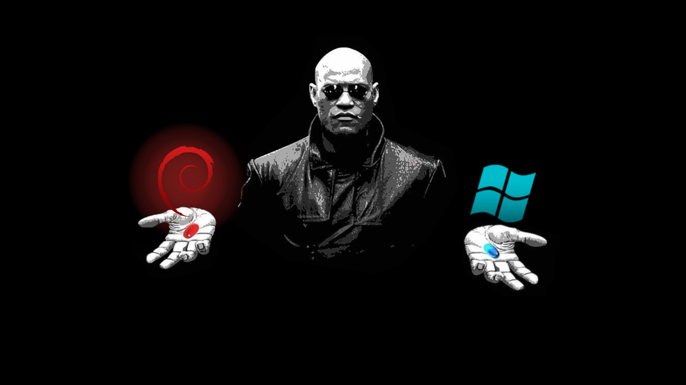
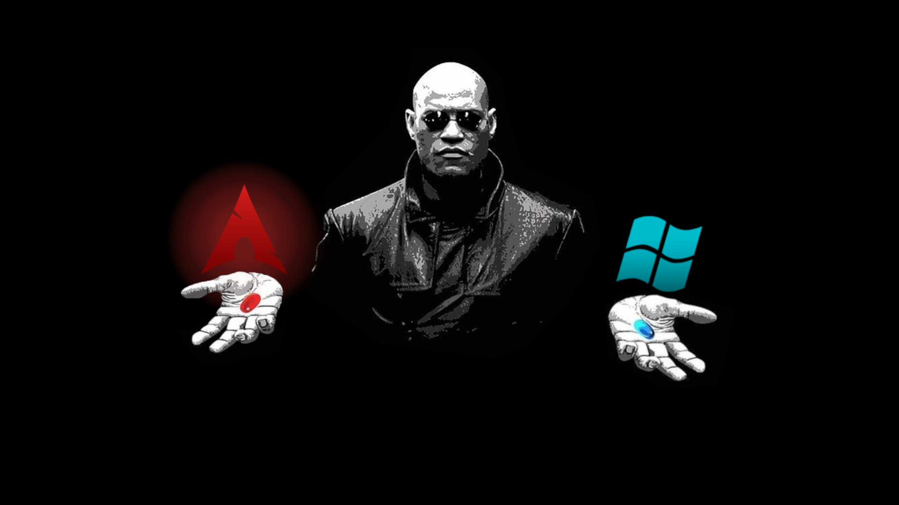
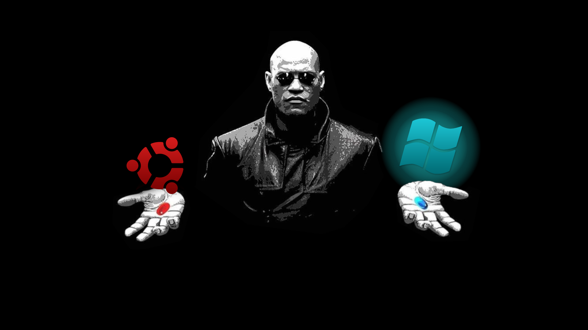
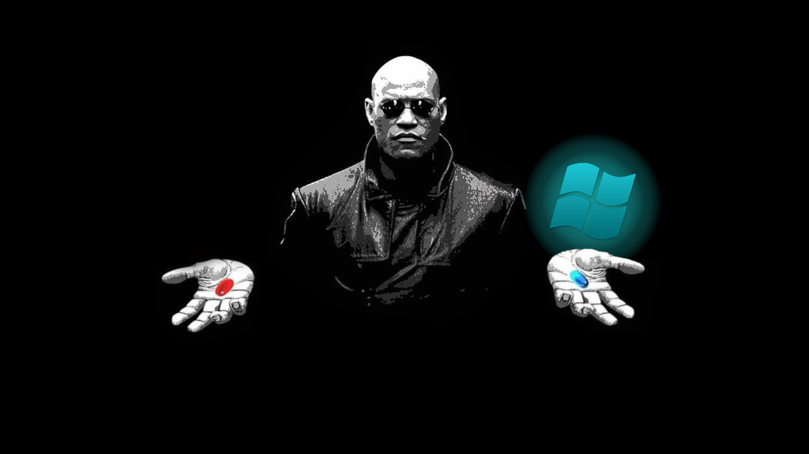

[English](../README.md) | [Русский](README-RU.md)

<div align="center">


</div>

# Matrix Morpheus GRUB Theme (Universal)

**Red Pill vs Blue Pill** — минималистичная GRUB‑тема в стиле «Матрицы» с полноэкранными иконками выбора ОС.

---

## Поддерживаемые дистрибутивы

Тема автоматически определяет дистрибутив и подставляет нужные иконки. Из коробки поддерживаются:

| | |
|:-------:|:-------:|
|<br>|**Debian** — `debian_on.png` / `debian_off.png`|
|<br>|**Arch** — `arch_on.png` / `arch_off.png`|
|<br>|**Ubuntu** — `ubuntu_on.png` / `ubuntu_off.png`|
|<br>|**Шаблоны** — `linux_template.png` / `windows_template.png`|

### Добавление своего дистрибутива

1. Создайте иконки `{name}_on.png` и `{name}_off.png` в `Matrix/icons/`
2. Добавьте строку в `distros.conf`:
   ```
   keyword|icon_on|icon_off
   ```
   Например для Fedora: `fedora|fedora_on.png|fedora_off.png`
3. Ключевое слово (keyword) сопоставляется по подстроке с `GRUB_DISTRIBUTOR` и `ID` из `/etc/os-release`

### Шаблоны для своих иконок

В папке `assets/` находятся шаблоны для самостоятельной доработки:

- `linux_template.png` — базовая картинка для Linux (красная пилюля)
- `windows_template.png` — базовая картинка для Windows (синяя пилюля)
- `linux.psd`, `windows.psd` — исходники для Photoshop

Эти шаблоны используются как fallback, если для вашего дистрибутива нет готовых иконок.

---

## Установка

1. Клонируйте репозиторий:
   ```bash
   git clone https://github.com/KroJIak/universal-matrix-morpheus-grub
   cd universal-matrix-morpheus-grub
   ```

2. Сделайте скрипт исполняемым:
   ```bash
   chmod +x install.sh
   ```

3. Запустите установку от root:
   ```bash
   sudo ./install.sh
   ```

4. При установке будет предложено:
   - **Разрешение экрана** — HD, Full HD, 2K или 4K (корректный размер загрузчика на высоком DPI)
   - **Определение Linux/Windows** — только при неудаче автоопределения: какой пункт меню — Linux, какой — Windows
   - **Дистрибутив для иконок** — только если дистрибутив не найден: выбор из списка

5. **Важно:** Тема рассчитана ровно на **2 пункта загрузки** (ваш Linux и Windows). Если их больше (UEFI, Advanced options и т.д.), установщик объяснит, как сократить меню.

6. Установщик также скрывает краткий синий экран загрузки Debian/Ubuntu и надпись «Loading Linux...», используя чёрный фон и тихий режим.

7. Перезагрузитесь, чтобы увидеть тему.

---

## Логика выбора иконок

После проверки, что пунктов загрузки ровно 2, скрипт всё определяет автоматически:

1. **Linux и Windows** — Определяет, какой пункт меню — Linux, какой — Windows (по классам GRUB и названиям)
2. **Дистрибутив Linux** — Ищет совпадение в `distros.conf` (классы, названия, `/etc/os-release`)
3. Вопросы задаются **только при неудаче автоопределения**: какой пункт — Linux/Windows, какие иконки дистрибутива использовать
4. Запасной вариант: `assets/linux_template.png`, если дистрибутив не найден

Если установлена только Windows, `linux_template.png` используется как заглушка, а `windows_template.png` — для Windows.

---

## Структура проекта

```
├── Matrix/
│   ├── theme.txt       # Конфигурация темы GRUB
│   ├── font.pf2        # Шрифт
│   ├── icons/          # Иконки дистрибутивов (_on / _off)
│   ├── os_linux.png    # Пустой placeholder (legacy)
│   └── os_windows.png  # Пустой placeholder (legacy)
├── assets/
│   ├── linux_template.png
│   ├── windows_template.png
│   ├── black.png            # Чёрный пиксель для перехода загрузки
│   ├── linux.psd
│   └── windows.psd
├── distros.conf        # Конфигурация дистрибутивов и приоритетов
├── install.sh
└── README.md
```

`os_linux.png` и `os_windows.png` — пустые placeholder-файлы. Иконки для меню GRUB берутся из `Matrix/icons/` по классам (`arch`, `debian`, `ubuntu`, `windows` и т.д.) и подготавливаются скриптом установки.

---

## Упрощение меню GRUB

Тема работает **только с 2 пунктами загрузки** — Linux и Windows. При большем числе пунктов (Advanced options, UEFI Firmware Settings, несколько дистрибутивов) установщик завершится с инструкцией по их сокращению. Измените `/etc/default/grub` и скрипты в `/etc/grub.d/`, затем выполните `update-grub` и запустите установщик снова.

---

## Форк

Универсальная версия на основе [Matrix-Morpheus-GRUB-Theme](https://github.com/Priyank-Adhav/Matrix-Morpheus-GRUB-Theme) с поддержкой нескольких дистрибутивов.
